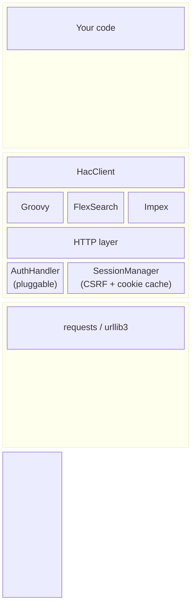

# hac-client-core

**Python client library for the SAP Commerce HAC (Hybris Administration Console) HTTP API.**

Execute Groovy scripts, run FlexibleSearch queries, import Impex data, and trigger system updates — all from Python, with automatic session management and CSRF handling.

---

## Features

- :material-language-python: **Groovy script execution** — run arbitrary Groovy in commit or rollback mode
- :material-database-search: **FlexibleSearch queries** — execute queries with typed result objects
- :material-file-import: **Impex import** — import Impex content with configurable validation
- :material-update: **System update** — trigger updates, select patches/parameters, poll logs
- :material-cookie: **Session management** — automatic login, CSRF tokens, session caching across runs
- :material-key-variant: **Pluggable authentication** — ships with Basic Auth; extend `AuthHandler` for OAuth, JWT, API keys, etc.
- :material-check-decagram: **Fully typed** — complete type annotations with a `py.typed` marker ([PEP 561](https://peps.python.org/pep-0561/))

## Quick start

```python
from hac_client_core import HacClient, BasicAuthHandler

auth = BasicAuthHandler("admin", "nimda")
client = HacClient(
    base_url="https://localhost:9002",
    auth_handler=auth,
    ignore_ssl=True,
)

client.login()

result = client.execute_groovy("return 'Hello from HAC'")
print(result.execution_result)  # "Hello from HAC"
```

See the [Getting started](getting-started.md) guide for installation instructions and a walkthrough.

## Architecture overview



The client is structured around a few key design decisions:

- **Pluggable auth** — `AuthHandler` is an abstract class.  `BasicAuthHandler` ships built-in; implement your own for OAuth, JWT, mTLS, etc.
- **Automatic sessions** — Login is performed lazily on the first API call.  Sessions (including CSRF tokens and route cookies) are cached to disk so subsequent runs skip the login round-trip.
- **Typed results** — Every API method returns a typed dataclass (`GroovyScriptResult`, `FlexibleSearchResult`, …) instead of raw dicts.

## License

[MIT](https://github.com/SapCommerceTools/ha-client-core/blob/main/LICENSE)
